# Defensa Técnica de Aplicación de Principios SOLID  
### Proyecto: JuegoRoles-SOLID

## Introducción

El proyecto consiste en un sistema RPG de combate por turnos desarrollado en Java, donde existen personajes con atributos propios, habilidades especiales, objetos equipables y estados alterados durante el combate.

Se desarrollaron dos versiones del mismo sistema:

- **RPG BASE** → Implementación inicial con enfoque orientado a objetos tradicional.
- **RPG SOLID** → Versión refactorizada aplicando principios SOLID.

El objetivo de la refactorización fue mejorar la estructura del sistema aplicando los principios SOLID definidos por :contentReference[oaicite:0]{index=0}, permitiendo que el proyecto sea más escalable, mantenible y flexible ante futuras modificaciones.

---
# UML COMPLETO — RPG SOLID

```mermaid
classDiagram

%% =========================
%% INTERFACES
%% =========================

class IHabilidad {
    <<interface>>
    +usar(usuario: Personaje, objetivo: Personaje) String
    +getNombre() String
    +getCostoEnergia() int
    +getCooldownMax() int
}

class IEstadoAlterado {
    <<interface>>
    +aplicarEfecto(p: Personaje) String
    +haTerminado() boolean
    +getNombre() String
}

%% =========================
%% OBJETOS
%% =========================

class Objeto {
    <<abstract>>
    #nombre: String
    +Objeto(nombre: String)
    +getNombre() String
    +getBonificadorAtaque() int
    +getBonificadorDefensa() int
}

class Arma {
    -bonificadorAtaque: int
    +Arma(nombre: String, bonificadorAtaque: int)
    +getBonificadorAtaque() int
}

class Armadura {
    -bonificadorDefensa: int
    +Armadura(nombre: String, bonificadorDefensa: int)
    +getBonificadorDefensa() int
}

class PocionEspecial {
    -curacion: int
    -bonoAtaqueTemporal: int
    +PocionEspecial(nombre: String, curacion: int, bonoAtaqueTemporal: int)
    +consumir(p: Personaje) String
}

%% =========================
%% PERSONAJE BASE
%% =========================

class Personaje {
    <<abstract>>
    #nombre: String
    #vidaMax: int
    #vidaActual: int
    #ataqueBase: int
    #defensaBase: int
    #energiaMax: int
    #energiaActual: int
    #cooldownHabilidad: int
    #estadosActivos: List
    #objetoEquipado: Objeto
    #habilidadEspecial: IHabilidad

    +Personaje(nombre, vidaMax, ataqueBase, defensaBase, energiaMax, habilidad)

    +calcularAtaque() int
    +calcularDefensa() int
    +atacar(objetivo: Personaje) String
    +recibirDaño(cantidad: int)
    +procesarTurno() List
    +usarEnergia(cantidad: int)
    +usarHabilidadEspecial(objetivo: Personaje) String
    +equiparObjeto(objeto: Objeto)

    +getNombre() String
    +getVidaActual() int
    +setVidaActual(v: int)
    +getEnergiaActual() int
    +setEnergiaActual(e: int)

    +getCooldownHabilidad() int
    +setCooldownHabilidad(c: int)

    +agregarEstado(e: IEstadoAlterado)
    +tieneEstado(n: String) boolean
}

%% =========================
%% PERSONAJES
%% =========================

class Guerrero {
    -fuerza: int
    -escudoActivo: boolean

    +Guerrero(nombre, vidaMax, ataqueBase, defensaBase, fuerza, h)
    +calcularAtaque() int
    +calcularDefensa() int
}

class Arquero {
    -precision: int
    -flechas: int

    +Arquero(nombre, vidaMax, ataqueBase, defensaBase, precision, flechas, h)

    +calcularAtaque() int
    +getFlechas() int
    +reducirFlechas(c: int)
}

class Mago {
    -intelecto: int

    +Mago(nombre, vidaMax, ataqueBase, defensaBase, intelecto, h)
    +calcularAtaque() int
}

%% =========================
%% HABILIDADES
%% =========================

class GolpeDevastador {
    +usar(u: Personaje, o: Personaje) String
    +getNombre() String
    +getCostoEnergia() int
    +getCooldownMax() int
}

class LluviaFlechas {
    +usar(u: Personaje, o: Personaje) String
    +getNombre() String
    +getCostoEnergia() int
    +getCooldownMax() int
}

class ExplosionArcana {
    +usar(u: Personaje, o: Personaje) String
    +getNombre() String
    +getCostoEnergia() int
    +getCooldownMax() int
}

%% =========================
%% ESTADOS ALTERADOS
%% =========================

class Congelado {
    -turnosRestantes: int
    +Congelado(t: int)

    +aplicarEfecto(p: Personaje) String
    +haTerminado() boolean
    +getNombre() String
}

class Envenenado {
    -turnosRestantes: int
    -danoPorTurno: int

    +Envenenado(t: int, d: int)

    +aplicarEfecto(p: Personaje) String
    +haTerminado() boolean
    +getNombre() String
}

class FuerzaAumentada {
    -turnosRestantes: int
    -bonus: int

    +FuerzaAumentada(t: int, bonus: int)

    +aplicarEfecto(p: Personaje) String
    +haTerminado() boolean
    +getNombre() String
}

%% =========================
%% CONTROLADOR Y VISTA
%% =========================

class SistemaCombate {
    -vista: VistaConsola

    +SistemaCombate(vista: VistaConsola)
    +iniciarCombate(j1: Personaje, j2: Personaje)
    +ejecutarTurno(activo: Personaje, objetivo: Personaje)
}

class VistaConsola {
    +mostrarInicioCombate(j1, j2)
    +mostrarTurno(turno)
    +mostrarTurnoJugador(jugador)
    +mostrarEstado(p1, p2)
    +mostrarGanador(j1, j2)
}

class Ejecutor {
    +main(args)
}

%% =========================
%% RELACIONES
%% =========================

Objeto <|-- Arma
Objeto <|-- Armadura
Objeto <|-- PocionEspecial

Personaje <|-- Guerrero
Personaje <|-- Arquero
Personaje <|-- Mago

IHabilidad <|.. GolpeDevastador
IHabilidad <|.. LluviaFlechas
IHabilidad <|.. ExplosionArcana

IEstadoAlterado <|.. Congelado
IEstadoAlterado <|.. Envenenado
IEstadoAlterado <|.. FuerzaAumentada

Personaje --> IHabilidad
Personaje --> IEstadoAlterado
Personaje --> Objeto

SistemaCombate --> VistaConsola
SistemaCombate --> Personaje

Ejecutor --> SistemaCombate
Ejecutor --> VistaConsola
```


---
# Arquitectura General del Proyecto

## RPG BASE

Toda la aplicación se encuentra en un único paquete:

```text
pkg1_juegorolesejecutor/

Personaje.java
SistemaCombate.java
Guerrero.java
Magos.java
Arqueros.java
Arma.java
Armadura.java
PocionEspecial.java
Congelado.java
Envenenado.java
FuerzaAumentada.java
```

Características:

- Código centralizado.
- Clases altamente dependientes unas de otras.
- Lógica de negocio mezclada con salida por consola.
- Difícil extensión futura.

---

## RPG SOLID

La aplicación se reorganiza por responsabilidades:

```text
modelo/
controlador/
vista/

modelo/base/
modelo/interfaces/
modelo/personajes/
modelo/mecanicas/
modelo/inventario/
```

Características:

- Código modular.
- Separación por responsabilidades.
- Uso de interfaces.
- Menor acoplamiento entre componentes.

---
# PRINCIPIO 1  
# SINGLE RESPONSIBILITY PRINCIPLE (SRP)

## Definición

El principio **Single Responsibility Principle** establece que una clase debe tener una única responsabilidad dentro del sistema.

En términos prácticos:

```text
Una clase no debe encargarse de múltiples tareas distintas.
```

Cuando una clase controla lógica interna, presentación visual, flujo del sistema y toma de decisiones al mismo tiempo, existe una violación de este principio.

---

# Auditoría inicial del proyecto RPG BASE

Para identificar SRP debemos analizar qué clases concentran demasiadas responsabilidades.

La auditoría detecta dos archivos principales:

```text
SistemaCombate.java
Personaje.java
```

Sin embargo, la refactorización realizada en el proyecto se concentra principalmente en:

```text
SistemaCombate.java
```

---

# Análisis de SistemaCombate.java en RPG BASE

Ubicación:

```text
pkg1_juegorolesejecutor/SistemaCombate.java
```

Código original.

```java
package pkg1_juegorolesejecutor;

public class SistemaCombate {

    public void iniciarCombate(Personaje jugador1, Personaje jugador2) {

        System.out.println("\n--- INICIO DEL COMBATE ---");
        System.out.println(jugador1.getNombre() + " VS " + jugador2.getNombre());

        int turno = 1;

        while (jugador1.getVidaActual() > 0 &&
               jugador2.getVidaActual() > 0) {

            System.out.println("\n--- TURNO " + turno + " ---");

            ejecutarTurnoPersonaje(jugador1, jugador2);

            if (jugador2.getVidaActual() <= 0) {
                break;
            }

            ejecutarTurnoPersonaje(jugador2, jugador1);

            turno++;
        }

        mostrarGanador(jugador1, jugador2);
    }

    private void ejecutarTurnoPersonaje(Personaje activo,
                                        Personaje objetivo) {

        System.out.println("\nTurno de " + activo.getNombre());

        activo.aplicarEstadoAlterado();

        if (activo.getVidaActual() <= 0) {
            return;
        }

        if (Math.random() < 0.4 &&
            activo.getEnergiaActual() >= 30) {

            activo.usarHabilidadEspecial(objetivo);

        } else {

            activo.atacar(objetivo);

        }

        activo.mostrarEstado();
        objetivo.mostrarEstado();
    }

    private void mostrarGanador(Personaje jugador1,
                                Personaje jugador2) {

        System.out.println("\n--- COMBATE FINALIZADO ---");

        if (jugador1.getVidaActual() > 0) {
            System.out.println("Ganador: " + jugador1.getNombre());
        } else {
            System.out.println("Ganador: " + jugador2.getNombre());
        }
    }
}
```

---

# Auditoría técnica del código BASE

Al analizar esta clase observamos que concentra múltiples responsabilidades completamente distintas.

---

## Responsabilidad 1 — Control general del combate

Bloque detectado.

```java
while (jugador1.getVidaActual() > 0 &&
       jugador2.getVidaActual() > 0) {

    ejecutarTurnoPersonaje(jugador1, jugador2);

    if (jugador2.getVidaActual() <= 0) {
        break;
    }

    ejecutarTurnoPersonaje(jugador2, jugador1);

    turno++;
}
```

Función detectada.

```text
Controlar el ciclo principal del combate.
```

Esta responsabilidad es correcta.

---

## Responsabilidad 2 — Presentación visual en consola

Bloques detectados.

```java
System.out.println("\n--- INICIO DEL COMBATE ---");
```

```java
System.out.println("\n--- TURNO " + turno + " ---");
```

```java
System.out.println("\nTurno de " + activo.getNombre());
```

```java
System.out.println("\n--- COMBATE FINALIZADO ---");
```

```java
System.out.println("Ganador: " + jugador1.getNombre());
```

Función detectada.

```text
Mostrar interfaz visual al usuario.
```

Problema.

La lógica del combate está acoplada directamente a la consola.

---

## Responsabilidad 3 — Administración interna del turno

Bloque detectado.

```java
private void ejecutarTurnoPersonaje(Personaje activo,
                                    Personaje objetivo) {

    activo.aplicarEstadoAlterado();

    if (activo.getVidaActual() <= 0) {
        return;
    }

    if (Math.random() < 0.4 &&
        activo.getEnergiaActual() >= 30) {

        activo.usarHabilidadEspecial(objetivo);

    } else {

        activo.atacar(objetivo);

    }
}
```

Función detectada.

```text
Controlar lógica interna de cada turno.
```

Esta responsabilidad sí corresponde a SistemaCombate.

---

## Responsabilidad 4 — Mostrar estado de personajes

Bloque detectado.

```java
activo.mostrarEstado();
objetivo.mostrarEstado();
```

Función detectada.

```text
Mostrar estadísticas visuales.
```

Problema.

SistemaCombate nuevamente está controlando interfaz visual.

---

## Responsabilidad 5 — Determinar ganador

Bloque detectado.

```java
private void mostrarGanador(Personaje jugador1,
                            Personaje jugador2) {

    if (jugador1.getVidaActual() > 0) {
        System.out.println("Ganador: " + jugador1.getNombre());
    }
}
```

Función detectada.

```text
Determinar resultado final + imprimir resultado.
```

Problema.

La clase mezcla lógica interna con presentación visual.

---

# Diagnóstico arquitectónico de RPG BASE

La clase SistemaCombate concentra demasiadas responsabilidades.

Actualmente controla:

```text
✓ Flujo del combate

✓ Turnos

✓ Decisiones de ataque

✓ Presentación visual

✓ Mostrar estados

✓ Mostrar ganador

✓ Comunicación con consola
```

Esto viola directamente SRP.

---

# Refactorización realizada en RPG SOLID

Durante la refactorización se separó el sistema en múltiples capas.

Nueva estructura.

```text
controlador/
    SistemaCombate.java

vista/
    VistaConsola.java
    Ejecutor.java
```

La responsabilidad visual es extraída completamente.

---

# SistemaCombate.java en RPG SOLID

Ubicación.

```text
controlador/SistemaCombate.java
```

Código.

```java
package controlador;

import modelo.base.Personaje;
import vista.VistaConsola;

public class SistemaCombate {

    private VistaConsola vista;

    public SistemaCombate(VistaConsola vista) {
        this.vista = vista;
    }

    public void iniciarCombate(Personaje jugador1,
                               Personaje jugador2) {

        vista.mostrarInicioCombate(jugador1, jugador2);

        int turno = 1;

        while (jugador1.estaVivo() &&
               jugador2.estaVivo()) {

            vista.mostrarTurno(turno);

            ejecutarTurno(jugador1, jugador2);

            if (!jugador2.estaVivo()) {
                break;
            }

            ejecutarTurno(jugador2, jugador1);

            turno++;
        }

        vista.mostrarGanador(jugador1, jugador2);
    }

    private void ejecutarTurno(Personaje activo,
                               Personaje objetivo) {

        vista.mostrarTurnoJugador(activo);

        activo.aplicarEstadoAlterado();

        if (!activo.estaVivo()) {
            return;
        }

        activo.realizarAccion(objetivo);

        vista.mostrarEstado(activo, objetivo);
    }
}
```

---

# Nueva clase creada — VistaConsola.java

Ubicación.

```text
vista/VistaConsola.java
```

Código.

```java
package vista;

import modelo.base.Personaje;

public class VistaConsola {

    public void mostrarInicioCombate(Personaje j1,
                                     Personaje j2) {

        System.out.println("\n=== COMBATE ===");
        System.out.println(j1.getNombre() +
                           " VS " +
                           j2.getNombre());
    }

    public void mostrarTurno(int turno) {

        System.out.println("\n--- TURNO " +
                           turno +
                           " ---");
    }

    public void mostrarTurnoJugador(Personaje jugador) {

        System.out.println("\nTurno de " +
                           jugador.getNombre());
    }

    public void mostrarEstado(Personaje p1,
                              Personaje p2) {

        p1.mostrarEstado();
        p2.mostrarEstado();
    }

    public void mostrarGanador(Personaje j1,
                               Personaje j2) {

        if (j1.estaVivo()) {
            System.out.println("Ganador: " +
                               j1.getNombre());
        } else {
            System.out.println("Ganador: " +
                               j2.getNombre());
        }
    }
}
```

---

# Comparación estructural directa

## RPG BASE

```java
System.out.println("\n--- INICIO DEL COMBATE ---");
```

```java
System.out.println("\n--- TURNO " + turno + " ---");
```

```java
System.out.println("\nTurno de " + activo.getNombre());
```

```java
System.out.println("Ganador: " + jugador1.getNombre());
```

Todo ocurre dentro de:

```text
SistemaCombate.java
```

---

## RPG SOLID

Se reemplaza por delegación.

```java
vista.mostrarInicioCombate(jugador1, jugador2);
```

```java
vista.mostrarTurno(turno);
```

```java
vista.mostrarTurnoJugador(activo);
```

```java
vista.mostrarEstado(activo, objetivo);
```

```java
vista.mostrarGanador(jugador1, jugador2);
```

La presentación visual es removida de:

```text
SistemaCombate.java
```

Y trasladada a:

```text
VistaConsola.java
```

---

# Segunda mejora SRP detectada

En RPG BASE el punto de entrada del programa estaba mezclado dentro del sistema principal.

En RPG SOLID aparece una nueva clase.

```text
Ejecutor.java
```

Código.

```java
public class Ejecutor {

    public static void main(String[] args) {

        VistaConsola vista = new VistaConsola();

        SistemaCombate combate =
                new SistemaCombate(vista);

        combate.iniciarCombate(
                jugador1,
                jugador2);
    }
}
```

---

# Cambio arquitectónico producido

Antes.

```text
SistemaCombate

→ controla combate

→ controla consola

→ imprime resultados

→ muestra estados

→ controla ejecución principal
```

Después.

```text
SistemaCombate

→ controla lógica interna


VistaConsola

→ controla presentación visual


Ejecutor

→ controla inicialización del programa
```

---

# Resultado final de la implementación

Durante la refactorización se detectó que SistemaCombate realizaba múltiples tareas distintas.

Se realizó separación de responsabilidades en tres componentes independientes.

```text
RPG BASE

SistemaCombate = demasiadas responsabilidades
```

```text
RPG SOLID

SistemaCombate = lógica del combate

VistaConsola = presentación visual

Ejecutor = inicialización del sistema
```

Principio implementado.

```text
SRP
```

---
# PRINCIPIO 2  
# OPEN CLOSED PRINCIPLE (OCP)

## Definición

El principio **Open Closed Principle** establece que una clase debe estar abierta a extensión pero cerrada a modificación.

En términos prácticos:

```text
El sistema debe permitir agregar nuevas funcionalidades sin tener que modificar código existente.
```

Si al agregar una nueva característica es necesario editar clases ya construidas, existe una violación de este principio.

---

# Auditoría inicial en RPG BASE

Para identificar OCP debemos localizar puntos donde el sistema depende directamente de implementaciones concretas.

Durante la auditoría se detectó el archivo principal:

```text
pkg1_juegorolesejecutor/SistemaCombate.java
```

Además se detectó acoplamiento secundario en:

```text
Guerrero.java

Magos.java

Arqueros.java
```

---

# Análisis de SistemaCombate.java en RPG BASE

Código original.

```java
package pkg1_juegorolesejecutor;

public class SistemaCombate {

    public void iniciarCombate(Personaje jugador1,
                               Personaje jugador2) {

        System.out.println("\n--- INICIO DEL COMBATE ---");
        System.out.println(jugador1.getNombre() + " VS " + jugador2.getNombre());

        int turno = 1;

        while (jugador1.getVidaActual() > 0 &&
               jugador2.getVidaActual() > 0) {

            System.out.println("\n--- TURNO " + turno + " ---");

            ejecutarTurnoPersonaje(jugador1, jugador2);

            if (jugador2.getVidaActual() <= 0) {
                break;
            }

            ejecutarTurnoPersonaje(jugador2, jugador1);

            turno++;
        }

        mostrarGanador(jugador1, jugador2);
    }

    private void ejecutarTurnoPersonaje(Personaje activo,
                                        Personaje objetivo) {

        System.out.println("\nTurno de " + activo.getNombre());

        activo.aplicarEstadoAlterado();

        if (activo.getVidaActual() <= 0) {
            return;
        }

        if (Math.random() < 0.4 &&
            activo.getEnergiaActual() >= 30) {

            activo.usarHabilidadEspecial(objetivo);

        } else {

            activo.atacar(objetivo);

        }

        activo.mostrarEstado();
        objetivo.mostrarEstado();
    }
}
```

---

# Primera observación importante

A primera vista parece que el sistema usa abstracción porque trabaja con:

```java
Personaje activo
```

Sin embargo el verdadero problema aparece al revisar cómo están implementadas las habilidades especiales.

Debemos auditar las subclases concretas.

---

# Guerrero.java en RPG BASE

Código.

```java
package pkg1_juegorolesejecutor;

public class Guerrero extends Personaje {

    public Guerrero(String nombre) {

        super(nombre,
              150,
              25,
              15,
              100);
    }

    @Override
    public void usarHabilidadEspecial(
                    Personaje objetivo) {

        if (energiaActual >= 30) {

            gastarEnergia(30);

            int daño = calcularAtaque() * 2;

            System.out.println(nombre +
                               " usa GOLPE DEVASTADOR");

            objetivo.recibirDaño(daño);
        }
    }
}
```

---

# Magos.java en RPG BASE

Código.

```java
package pkg1_juegorolesejecutor;

public class Magos extends Personaje {

    public Magos(String nombre) {

        super(nombre,
              100,
              15,
              8,
              120);
    }

    @Override
    public void usarHabilidadEspecial(
                    Personaje objetivo) {

        if (energiaActual >= 40) {

            gastarEnergia(40);

            int daño = calcularAtaque() * 3;

            System.out.println(nombre +
                               " usa EXPLOSION ARCANA");

            objetivo.recibirDaño(daño);
        }
    }
}
```

---

# Arqueros.java en RPG BASE

Código.

```java
package pkg1_juegorolesejecutor;

public class Arqueros extends Personaje {

    public Arqueros(String nombre) {

        super(nombre,
              110,
              20,
              10,
              90);
    }

    @Override
    public void usarHabilidadEspecial(
                    Personaje objetivo) {

        if (energiaActual >= 25) {

            gastarEnergia(25);

            int daño = calcularAtaque() + 30;

            System.out.println(nombre +
                               " usa LLUVIA DE FLECHAS");

            objetivo.recibirDaño(daño);
        }
    }
}
```

---

# Problema detectado en RPG BASE

Cada personaje implementa internamente su habilidad especial.

Actualmente tenemos:

```text
Guerrero → Golpe Devastador

Magos → Explosion Arcana

Arqueros → Lluvia de Flechas
```

Eso parece correcto inicialmente.

Pero aparece el problema cuando queremos agregar una nueva habilidad o un nuevo personaje.

Ejemplo.

Supongamos que agregamos:

```text
Asesino.java
```

Debemos crear.

```java
public class Asesino extends Personaje {

    @Override
    public void usarHabilidadEspecial(
                        Personaje objetivo){

         // nueva lógica interna
    }
}
```

Ahora el comportamiento queda incrustado dentro del personaje.

---

# Problema arquitectónico real

Actualmente habilidad y personaje son inseparables.

La lógica especial vive dentro de cada subclase.

```text
Guerrero contiene Golpe Devastador

Magos contiene Explosion Arcana

Arqueros contiene Lluvia Flechas
```

Esto genera rigidez.

No podemos reutilizar habilidades.

No podemos extender habilidades sin modificar jerarquía existente.

---

# Refactorización realizada en RPG SOLID

Durante la refactorización se crea una nueva abstracción.

Archivo nuevo.

```text
modelo/interfaces/IHabilidad.java
```

Código.

```java
package modelo.interfaces;

import modelo.base.Personaje;

public interface IHabilidad {

    String usar(Personaje usuario,
                Personaje objetivo);

    String getNombre();

    int getCostoEnergia();

    int getCooldownMax();
}
```

Ahora el comportamiento especial se desacopla del personaje.

---

# Nuevas implementaciones de habilidades

Se crean clases independientes.

```text
modelo/mecanicas/
```

Archivos creados.

```text
GolpeDevastador.java

ExplosionArcana.java

LluviaFlechas.java
```

---

# GolpeDevastador.java

Código.

```java
package modelo.mecanicas;

import modelo.base.Personaje;
import modelo.interfaces.IHabilidad;

public class GolpeDevastador
       implements IHabilidad {

    @Override
    public String usar(Personaje usuario,
                       Personaje objetivo) {

        int daño =
            usuario.calcularAtaque() * 2;

        objetivo.recibirDaño(daño);

        return usuario.getNombre() +
               " usa Golpe Devastador";
    }

    @Override
    public String getNombre() {
        return "Golpe Devastador";
    }

    @Override
    public int getCostoEnergia() {
        return 30;
    }

    @Override
    public int getCooldownMax() {
        return 2;
    }
}
```

---

# ExplosionArcana.java

Código.

```java
public class ExplosionArcana
       implements IHabilidad {

    @Override
    public String usar(Personaje usuario,
                       Personaje objetivo) {

        int daño =
            usuario.calcularAtaque() * 3;

        objetivo.recibirDaño(daño);

        return usuario.getNombre() +
               " usa Explosion Arcana";
    }

    @Override
    public int getCostoEnergia() {
        return 40;
    }
}
```

---

# Cambio dentro de Personaje.java

Antes en RPG BASE.

```java
public abstract class Personaje {

    public abstract void atacar(
                    Personaje objetivo);

    public abstract void usarHabilidadEspecial(
                    Personaje objetivo);

}
```

---

Ahora en RPG SOLID.

```java
package modelo.base;

import modelo.interfaces.IHabilidad;

public abstract class Personaje {

    protected IHabilidad habilidadEspecial;

    public Personaje(String nombre,
                     int vidaMax,
                     int ataqueBase,
                     int defensaBase,
                     int energiaMax,
                     IHabilidad habilidad) {

        this.habilidadEspecial = habilidad;
    }

    public void usarHabilidadEspecial(
                        Personaje objetivo) {

        habilidadEspecial.usar(this,
                               objetivo);
    }
}
```

---

# Cambio en Guerrero.java

## RPG BASE

```java
public class Guerrero extends Personaje {

    @Override
    public void usarHabilidadEspecial(
                    Personaje objetivo) {

        if (energiaActual >= 30) {

            gastarEnergia(30);

            int daño = calcularAtaque() * 2;

            System.out.println(nombre +
                               " usa GOLPE DEVASTADOR");

            objetivo.recibirDaño(daño);
        }
    }
}
```

Guerrero contiene lógica interna.

---

## RPG SOLID

```java
package modelo.personajes;

import modelo.base.Personaje;
import modelo.mecanicas.GolpeDevastador;

public class Guerrero extends Personaje {

    public Guerrero(String nombre) {

        super(nombre,
              150,
              25,
              15,
              100,
              new GolpeDevastador());
    }
}
```

Ahora Guerrero no implementa habilidad.

Solo recibe una dependencia externa.

---

# Comparación arquitectónica directa

## RPG BASE

```text
Guerrero.java

→ contiene lógica GolpeDevastador
```

```text
Magos.java

→ contiene lógica ExplosionArcana
```

```text
Arqueros.java

→ contiene lógica LluviaFlechas
```

Cada habilidad vive dentro del personaje.

---

## RPG SOLID

```text
Guerrero.java

→ recibe GolpeDevastador
```

```text
Mago.java

→ recibe ExplosionArcana
```

```text
Arquero.java

→ recibe LluviaFlechas
```

La lógica se mueve fuera del personaje.

---

# Beneficio obtenido

Ahora agregar una nueva habilidad no requiere modificar clases existentes.

Ejemplo.

Podemos crear:

```text
AtaqueSombrio.java
```

Simplemente implementando.

```java
public class AtaqueSombrio
       implements IHabilidad
```

Sin tocar.

```text
Guerrero.java

Mago.java

Arquero.java
```

---

# Cambio arquitectónico producido

Antes.

```text
Personaje contenía directamente comportamiento especial
```

Después.

```text
Personaje delega comportamiento especial a una interfaz externa
```

---

# Resultado final

Durante la refactorización se separó la lógica de habilidades especiales del sistema de personajes.

Se creó una arquitectura extensible basada en abstracciones.

```text
RPG BASE

Personajes contienen lógica interna
```

```text
RPG SOLID

Las habilidades son componentes independientes reutilizables
```

Principio implementado.

```text
OCP
```

---
# PRINCIPIO 3  
# LISKOV SUBSTITUTION PRINCIPLE (LSP)

## Definición

El principio **Liskov Substitution Principle** establece que cualquier subclase debe poder reemplazar a su clase padre sin alterar el funcionamiento esperado del sistema.

En términos prácticos:

```text
Si el sistema trabaja con una abstracción, no debería necesitar conocer qué implementación concreta está utilizando.
```

Cuando una clase necesita preguntar explícitamente qué tipo exacto de objeto está utilizando, normalmente existe una mala aplicación del polimorfismo.

---

# Auditoría inicial en RPG BASE

Para identificar LSP debemos buscar puntos donde el sistema aparenta usar abstracción, pero internamente depende del tipo concreto de los objetos.

La auditoría detectó dos archivos principales:

```text
SistemaCombate.java

Personaje.java
```

El problema no está en la herencia.

El problema está en cómo el sistema utiliza esa herencia.

---

# Personaje.java en RPG BASE

Ubicación.

```text
pkg1_juegorolesejecutor/Personaje.java
```

Código.

```java
package pkg1_juegorolesejecutor;

public abstract class Personaje {

    protected String nombre;
    protected int vidaActual;
    protected int ataqueBase;
    protected int defensaBase;
    protected int energiaActual;

    public Personaje(String nombre,
                     int vida,
                     int ataque,
                     int defensa,
                     int energia) {

        this.nombre = nombre;
        this.vidaActual = vida;
        this.ataqueBase = ataque;
        this.defensaBase = defensa;
        this.energiaActual = energia;
    }

    public abstract void atacar(
                        Personaje objetivo);

    public abstract void usarHabilidadEspecial(
                        Personaje objetivo);

    public void aplicarEstadoAlterado() {

        if (estadoActual != null) {

            estadoActual.aplicarEfecto(this);
        }
    }

    public void mostrarEstado() {

        System.out.println("Vida: " +
                           vidaActual +
                           " Energia: " +
                           energiaActual);
    }
}
```

---

# Primera observación

El sistema parece correctamente diseñado.

Existe una abstracción:

```java
Personaje
```

Y existen subclases.

```text
Guerrero

Magos

Arqueros
```

En teoría esto representa polimorfismo.

Pero debemos revisar cómo SistemaCombate utiliza esa abstracción.

---

# SistemaCombate.java en RPG BASE

Código.

```java
package pkg1_juegorolesejecutor;

public class SistemaCombate {

    public void iniciarCombate(Personaje jugador1,
                               Personaje jugador2) {

        System.out.println("\n--- INICIO DEL COMBATE ---");

        int turno = 1;

        while (jugador1.getVidaActual() > 0 &&
               jugador2.getVidaActual() > 0) {

            ejecutarTurnoPersonaje(jugador1,
                                   jugador2);

            if (jugador2.getVidaActual() <= 0) {
                break;
            }

            ejecutarTurnoPersonaje(jugador2,
                                   jugador1);

            turno++;
        }

        mostrarGanador(jugador1, jugador2);
    }

    private void ejecutarTurnoPersonaje(
                    Personaje activo,
                    Personaje objetivo) {

        System.out.println("\nTurno de " +
                           activo.getNombre());

        activo.aplicarEstadoAlterado();

        if (activo.getVidaActual() <= 0) {
            return;
        }

        if (Math.random() < 0.4 &&
            activo.getEnergiaActual() >= 30) {

            activo.usarHabilidadEspecial(
                                    objetivo);

        } else {

            activo.atacar(objetivo);

        }

        activo.mostrarEstado();
        objetivo.mostrarEstado();
    }
}
```

---

# Problema arquitectónico detectado

A primera vista parece correcto.

SistemaCombate trabaja con:

```java
Personaje activo
```

Sin embargo existe un problema oculto.

La lógica de comportamiento especial depende internamente del tipo concreto del personaje.

Debemos revisar las subclases.

---

# Guerrero.java en RPG BASE

Código.

```java
public class Guerrero extends Personaje {

    public Guerrero(String nombre) {

        super(nombre,
              150,
              25,
              15,
              100);
    }

    @Override
    public void usarHabilidadEspecial(
                        Personaje objetivo) {

        if (energiaActual >= 30) {

            gastarEnergia(30);

            int daño =
                calcularAtaque() * 2;

            objetivo.recibirDaño(daño);
        }
    }
}
```

---

# Magos.java en RPG BASE

Código.

```java
public class Magos extends Personaje {

    public Magos(String nombre) {

        super(nombre,
              100,
              15,
              8,
              120);
    }

    @Override
    public void usarHabilidadEspecial(
                        Personaje objetivo) {

        if (energiaActual >= 40) {

            gastarEnergia(40);

            int daño =
                calcularAtaque() * 3;

            objetivo.recibirDaño(daño);
        }
    }
}
```

---

# Auditoría técnica del problema

Observemos cuidadosamente.

SistemaCombate ejecuta:

```java
activo.usarHabilidadEspecial(objetivo);
```

Pero el comportamiento final depende completamente de cada implementación interna.

Actualmente:

```text
Guerrero → consume 30 energía

Magos → consume 40 energía

Arqueros → consume 25 energía
```

El problema aparece porque cada subclase redefine reglas distintas internamente.

La abstracción:

```java
Personaje
```

No garantiza comportamiento consistente.

Cada implementación altera reglas internas.

---

# Ejemplo del problema

Supongamos que agregamos nueva clase.

```java
public class Tanque extends Personaje {

    @Override
    public void usarHabilidadEspecial(
                        Personaje objetivo){

        // no consume energía

        // usa cooldown distinto

        // lógica completamente distinta
    }
}
```

Ahora el sistema sigue aceptando:

```java
Personaje activo
```

Pero cada implementación puede alterar arbitrariamente las reglas.

La abstracción deja de garantizar comportamiento homogéneo.

---

# Refactorización en RPG SOLID

La solución fue estandarizar el comportamiento especial.

Se introduce una interfaz común.

Archivo nuevo.

```text
modelo/interfaces/IHabilidad.java
```

Código.

```java
package modelo.interfaces;

import modelo.base.Personaje;

public interface IHabilidad {

    String usar(Personaje usuario,
                Personaje objetivo);

    String getNombre();

    int getCostoEnergia();

    int getCooldownMax();
}
```

Ahora todas las habilidades deben respetar el mismo contrato.

---

# Nueva implementación en Personaje.java

Ubicación.

```text
modelo/base/Personaje.java
```

Código.

```java
package modelo.base;

import modelo.interfaces.IHabilidad;

public abstract class Personaje {

    protected String nombre;
    protected int vidaActual;
    protected int ataqueBase;
    protected int defensaBase;
    protected int energiaActual;

    protected IHabilidad habilidadEspecial;

    public Personaje(String nombre,
                     int vida,
                     int ataque,
                     int defensa,
                     int energia,
                     IHabilidad habilidad) {

        this.nombre = nombre;
        this.vidaActual = vida;
        this.ataqueBase = ataque;
        this.defensaBase = defensa;
        this.energiaActual = energia;

        this.habilidadEspecial = habilidad;
    }

    public void usarHabilidadEspecial(
                        Personaje objetivo) {

        habilidadEspecial.usar(this,
                               objetivo);
    }

    public void realizarAccion(
                        Personaje objetivo) {

        if (Math.random() < 0.4 &&
            energiaActual >=
            habilidadEspecial.getCostoEnergia()) {

            usarHabilidadEspecial(objetivo);

        } else {

            atacar(objetivo);
        }
    }
}
```

---

# Cambio importante detectado

En RPG BASE.

```java
public abstract void usarHabilidadEspecial(
                    Personaje objetivo);
```

Cada subclase decide cómo implementar reglas.

---

En RPG SOLID.

```java
protected IHabilidad habilidadEspecial;
```

```java
habilidadEspecial.getCostoEnergia()
```

```java
habilidadEspecial.usar(this, objetivo)
```

Ahora todas las habilidades respetan exactamente el mismo contrato.

---

# Ejemplo en GolpeDevastador.java

Código.

```java
package modelo.mecanicas;

public class GolpeDevastador
       implements IHabilidad {

    @Override
    public String usar(Personaje usuario,
                       Personaje objetivo) {

        int daño =
            usuario.calcularAtaque() * 2;

        objetivo.recibirDaño(daño);

        return usuario.getNombre() +
               " usa Golpe Devastador";
    }

    @Override
    public int getCostoEnergia() {
        return 30;
    }

    @Override
    public int getCooldownMax() {
        return 2;
    }
}
```

---

# Ejemplo en ExplosionArcana.java

Código.

```java
public class ExplosionArcana
       implements IHabilidad {

    @Override
    public String usar(Personaje usuario,
                       Personaje objetivo) {

        int daño =
            usuario.calcularAtaque() * 3;

        objetivo.recibirDaño(daño);

        return usuario.getNombre() +
               " usa Explosion Arcana";
    }

    @Override
    public int getCostoEnergia() {
        return 40;
    }

    @Override
    public int getCooldownMax() {
        return 3;
    }
}
```

---

# Comparación estructural directa

## RPG BASE

Cada subclase implementa libremente.

```java
public class Guerrero extends Personaje {

    @Override
    public void usarHabilidadEspecial(
                    Personaje objetivo){

        if(energiaActual >= 30){

            gastarEnergia(30);

            int daño =
                calcularAtaque() * 2;

            objetivo.recibirDaño(daño);
        }
    }
}
```

---

## RPG SOLID

El comportamiento se estandariza.

```java
protected IHabilidad habilidadEspecial;
```

```java
public void usarHabilidadEspecial(
                    Personaje objetivo){

    habilidadEspecial.usar(this,
                           objetivo);
}
```

Todas las habilidades respetan misma estructura.

```text
usar()

getCostoEnergia()

getCooldownMax()
```

---

# Cambio arquitectónico producido

Antes.

```text
Cada subclase redefinía comportamiento interno libremente.
```

Después.

```text
Todas las implementaciones deben respetar un contrato uniforme.
```

---

# Analogía práctica

Imaginemos un cargador USB.

El teléfono solo espera una interfaz estándar.

```text
Voltaje

Entrada USB

Protocolo compatible
```

No importa qué marca fabrica el cargador.

Todos deben respetar el mismo contrato.

Eso mismo ocurre aquí.

Antes:

```text
Cada personaje implementaba habilidades bajo sus propias reglas.
```

Después:

```text
Todas las habilidades respetan el contrato IHabilidad.
```

---

# Resultado final

Durante la refactorización se eliminó comportamiento inconsistente entre subclases.

La abstracción Personaje ahora puede trabajar con cualquier habilidad sin alterar el funcionamiento esperado del sistema.

```text
RPG BASE

Cada subclase redefinía reglas internas
```

```text
RPG SOLID

Todas las implementaciones respetan un contrato uniforme
```

Principio implementado.

```text
LSP
```

---
# PRINCIPIO 4  
# INTERFACE SEGREGATION PRINCIPLE (ISP)

## Definición

El principio **Interface Segregation Principle** establece que una clase no debe verse obligada a depender de métodos o responsabilidades que realmente no necesita implementar directamente.

En términos prácticos:

```text
Las responsabilidades complejas deben dividirse en contratos pequeños y especializados.
```

Cuando una clase concentra demasiados comportamientos internos o debe encargarse de múltiples funcionalidades distintas, normalmente existe una violación de este principio.

---

# Auditoría inicial en RPG BASE

Para identificar ISP debemos localizar clases donde múltiples responsabilidades distintas se encuentran concentradas dentro de una misma estructura.

La auditoría detectó un archivo principal:

```text
pkg1_juegorolesejecutor/Personaje.java
```

Además existen responsabilidades internas mezcladas en las subclases:

```text
Guerrero.java

Magos.java

Arqueros.java
```

---

# Análisis de Personaje.java en RPG BASE

Código original.

```java
package pkg1_juegorolesejecutor;

public abstract class Personaje {

    protected String nombre;
    protected int vidaActual;
    protected int ataqueBase;
    protected int defensaBase;
    protected int energiaActual;

    protected Object objetoEquipado;

    protected IEstadoAlterado estadoActual;

    public Personaje(String nombre,
                     int vida,
                     int ataque,
                     int defensa,
                     int energia) {

        this.nombre = nombre;
        this.vidaActual = vida;
        this.ataqueBase = ataque;
        this.defensaBase = defensa;
        this.energiaActual = energia;
    }

    public abstract void atacar(
                        Personaje objetivo);

    public abstract void usarHabilidadEspecial(
                        Personaje objetivo);

    public void equiparObjeto(Object objeto) {

        this.objetoEquipado = objeto;
    }

    public void aplicarEstadoAlterado() {

        if (estadoActual != null) {
            estadoActual.aplicarEfecto(this);
        }
    }

    public void mostrarEstado() {

        System.out.println("Vida: " +
                           vidaActual +
                           " Energia: " +
                           energiaActual);
    }
}
```

---

# Auditoría técnica inicial

Analizando esta clase observamos que Personaje concentra demasiadas responsabilidades distintas.

Actualmente controla:

```text
Estadísticas base

Sistema de combate

Habilidades especiales

Inventario

Objetos equipables

Estados alterados

Presentación visual del estado
```

Esto provoca que el personaje dependa de demasiados comportamientos internos.

---

# Primera responsabilidad mezclada — habilidades especiales

Bloque detectado.

```java
public abstract void usarHabilidadEspecial(
                    Personaje objetivo);
```

Esto obliga a cada personaje a implementar directamente lógica de habilidades.

---

# Segunda responsabilidad mezclada — equipamiento

Bloque detectado.

```java
protected Object objetoEquipado;
```

```java
public void equiparObjeto(Object objeto) {

    this.objetoEquipado = objeto;
}
```

Personaje administra directamente objetos equipables.

---

# Tercera responsabilidad mezclada — estados alterados

Bloque detectado.

```java
protected IEstadoAlterado estadoActual;
```

```java
public void aplicarEstadoAlterado() {

    if (estadoActual != null) {
        estadoActual.aplicarEfecto(this);
    }
}
```

Personaje administra directamente efectos alterados.

---

# Cuarta responsabilidad mezclada — presentación visual

Bloque detectado.

```java
public void mostrarEstado() {

    System.out.println("Vida: " +
                       vidaActual +
                       " Energia: " +
                       energiaActual);
}
```

La clase incluso controla salida en consola.

---

# Problema arquitectónico

La clase Personaje está funcionando como núcleo central del sistema.

Actualmente mezcla demasiadas responsabilidades.

```text
Personaje combate

Personaje controla habilidades

Personaje administra inventario

Personaje administra estados

Personaje imprime datos
```

El contrato es demasiado grande.

---

# Refactorización en RPG SOLID

La solución consistió en separar responsabilidades utilizando interfaces especializadas.

Se crean nuevos contratos independientes.

Nueva estructura.

```text
modelo/interfaces/

IHabilidad.java

IEstadoAlterado.java
```

Además se reorganizan objetos del inventario.

```text
modelo/inventario/

Arma.java

Armadura.java

PocionEspecial.java
```

---

# Primer cambio — separación de habilidades

Se crea nueva interfaz.

Archivo nuevo.

```text
modelo/interfaces/IHabilidad.java
```

Código.

```java
package modelo.interfaces;

import modelo.base.Personaje;

public interface IHabilidad {

    String usar(Personaje usuario,
                Personaje objetivo);

    String getNombre();

    int getCostoEnergia();

    int getCooldownMax();
}
```

Ahora la lógica especial deja de pertenecer al personaje.

---

# Cambio en Personaje.java

Antes.

```java
public abstract void usarHabilidadEspecial(
                    Personaje objetivo);
```

Después.

```java
package modelo.base;

import modelo.interfaces.IHabilidad;

public abstract class Personaje {

    protected IHabilidad habilidadEspecial;

    public void usarHabilidadEspecial(
                        Personaje objetivo){

        habilidadEspecial.usar(this,
                               objetivo);
    }
}
```

La lógica se delega externamente.

---

# Segundo cambio — separación de estados alterados

Se mantiene interfaz independiente.

Archivo.

```text
modelo/interfaces/IEstadoAlterado.java
```

Código.

```java
package modelo.interfaces;

import modelo.base.Personaje;

public interface IEstadoAlterado {

    String aplicarEfecto(Personaje personaje);

    String getNombre();

    int getDuracionRestante();

    boolean estaActivo();
}
```

Ahora los estados alterados funcionan como contrato independiente.

---

# Ejemplo — Congelado.java

Código.

```java
package modelo.mecanicas;

import modelo.interfaces.IEstadoAlterado;

public class Congelado
       implements IEstadoAlterado {

    private int duracion;

    public Congelado(int turnos){

        this.duracion = turnos;
    }

    @Override
    public String aplicarEfecto(
                    Personaje personaje){

        personaje.reducirVelocidad();

        duracion--;

        return "Congelado";
    }

    @Override
    public boolean estaActivo(){

        return duracion > 0;
    }
}
```

La lógica deja de vivir dentro de Personaje.

---

# Tercer cambio — separación de objetos del inventario

En RPG BASE.

```java
protected Object objetoEquipado;
```

```java
public void equiparObjeto(Object objeto){

    this.objetoEquipado = objeto;
}
```

No existe estructura clara.

Todo se almacena como Object.

---

En RPG SOLID.

```java
protected Objeto objetoEquipado;
```

Código.

```java
package modelo.base;

public abstract class Objeto {

    protected String nombre;

    public abstract void aplicarEfecto(
                        Personaje personaje);
}
```

Subclases concretas.

```text
Arma.java

Armadura.java

PocionEspecial.java
```

---

# Ejemplo — Arma.java

Código.

```java
package modelo.inventario;

import modelo.base.Objeto;

public class Arma extends Objeto {

    private int aumentoAtaque;

    public Arma(String nombre,
                int aumento){

        this.nombre = nombre;
        this.aumentoAtaque = aumento;
    }

    @Override
    public void aplicarEfecto(
                    Personaje personaje){

        personaje.aumentarAtaque(
                    aumentoAtaque);
    }
}
```

La responsabilidad de inventario queda desacoplada.

---

# Comparación estructural directa

## RPG BASE

Personaje concentra múltiples responsabilidades.

```java
public abstract class Personaje {

    protected Object objetoEquipado;

    protected IEstadoAlterado estadoActual;

    public abstract void usarHabilidadEspecial(
                        Personaje objetivo);

    public void equiparObjeto(Object objeto){

        this.objetoEquipado = objeto;
    }

    public void aplicarEstadoAlterado(){

        if(estadoActual != null){

            estadoActual.aplicarEfecto(this);
        }
    }

    public void mostrarEstado(){

        System.out.println("Vida...");
    }
}
```

---

## RPG SOLID

Se delegan responsabilidades.

```java
public abstract class Personaje {

    protected IHabilidad habilidadEspecial;

    protected Objeto objetoEquipado;

    protected IEstadoAlterado estadoActual;

    public void usarHabilidadEspecial(
                    Personaje objetivo){

        habilidadEspecial.usar(this,
                               objetivo);
    }

    public void aplicarEstadoAlterado(){

        estadoActual.aplicarEfecto(this);
    }
}
```

Las implementaciones reales ahora viven fuera.

```text
IHabilidad → controla habilidades

IEstadoAlterado → controla estados

Objeto → controla inventario
```

---

# Cambio arquitectónico producido

Antes.

```text
Personaje contenía demasiados comportamientos internos.
```

Después.

```text
Personaje delega responsabilidades a contratos especializados.
```

---

# Analogía práctica

Imaginemos un hospital.

No tendría sentido que un médico haga todo.

```text
Atender pacientes

Realizar cirugías

Administrar farmacia

Llevar contabilidad

Gestionar laboratorio
```

Eso genera saturación de responsabilidades.

Lo correcto es dividir tareas.

```text
Doctor → tratamiento

Farmacia → medicamentos

Laboratorio → análisis
```

Eso mismo ocurre aquí.

Antes.

```text
Personaje hacía demasiadas tareas.
```

Después.

```text
Cada responsabilidad se delega a interfaces especializadas.
```

---

# Resultado final

Durante la refactorización se detectó que Personaje concentraba demasiados comportamientos distintos.

Se fragmentaron responsabilidades utilizando contratos independientes.

```text
RPG BASE

Personaje centraliza demasiadas funciones
```

```text
RPG SOLID

Cada comportamiento importante se mueve a interfaces especializadas
```

Principio implementado.

```text
ISP
```

---
# PRINCIPIO 5  
# DEPENDENCY INVERSION PRINCIPLE (DIP)

## Definición

El principio **Dependency Inversion Principle** establece que los módulos de alto nivel no deben depender directamente de implementaciones concretas.

Ambos deben depender de abstracciones.

En términos prácticos:

```text
Las clases importantes del sistema no deben estar conectadas directamente a clases concretas.
```

Cuando una clase depende directamente de objetos específicos o implementaciones rígidas, cualquier cambio en esas implementaciones termina afectando toda la arquitectura.

---

# Auditoría inicial en RPG BASE

Para identificar DIP debemos localizar dependencias directas entre clases principales y componentes concretos.

Durante la auditoría se detectaron tres puntos críticos.

Archivos afectados.

```text
SistemaCombate.java

Personaje.java

Subclases de Personaje
```

Problemas detectados.

```text
Dependencia directa con consola

Dependencia directa con implementaciones internas

Dependencia débil en sistema de inventario
```

---

# Primera dependencia detectada  
# SistemaCombate depende directamente de consola

Archivo.

```text
pkg1_juegorolesejecutor/SistemaCombate.java
```

Código.

```java
package pkg1_juegorolesejecutor;

public class SistemaCombate {

    public void iniciarCombate(Personaje jugador1,
                               Personaje jugador2) {

        System.out.println("\n--- INICIO DEL COMBATE ---");
        System.out.println(jugador1.getNombre() +
                           " VS " +
                           jugador2.getNombre());

        int turno = 1;

        while (jugador1.getVidaActual() > 0 &&
               jugador2.getVidaActual() > 0) {

            System.out.println("\n--- TURNO " +
                               turno +
                               " ---");

            ejecutarTurnoPersonaje(jugador1,
                                   jugador2);

            if (jugador2.getVidaActual() <= 0) {
                break;
            }

            ejecutarTurnoPersonaje(jugador2,
                                   jugador1);

            turno++;
        }

        mostrarGanador(jugador1, jugador2);
    }

    private void ejecutarTurnoPersonaje(
                    Personaje activo,
                    Personaje objetivo) {

        System.out.println("\nTurno de " +
                           activo.getNombre());

        activo.aplicarEstadoAlterado();

        if (activo.getVidaActual() <= 0) {
            return;
        }

        if (Math.random() < 0.4 &&
            activo.getEnergiaActual() >= 30) {

            activo.usarHabilidadEspecial(
                                    objetivo);

        } else {

            activo.atacar(objetivo);
        }

        activo.mostrarEstado();
        objetivo.mostrarEstado();
    }
}
```

---

# Auditoría técnica

Observemos cuidadosamente.

SistemaCombate depende directamente de:

```java
System.out.println()
```

Se detectan múltiples dependencias concretas.

```java
System.out.println("\n--- INICIO DEL COMBATE ---");
```

```java
System.out.println("\n--- TURNO " + turno);
```

```java
System.out.println("\nTurno de " + activo.getNombre());
```

---

## Problema detectado

SistemaCombate depende completamente del mecanismo concreto de salida.

Actualmente solo funciona con:

```text
Consola Java
```

Si quisiéramos cambiar interfaz a:

```text
Interfaz gráfica

Interfaz web

Interfaz móvil
```

Debemos modificar directamente SistemaCombate.

Esto rompe DIP.

---

# Segunda dependencia detectada  
# Personaje depende directamente de implementaciones internas

Archivo.

```text
pkg1_juegorolesejecutor/Personaje.java
```

Código.

```java
package pkg1_juegorolesejecutor;

public abstract class Personaje {

    protected String nombre;
    protected int vidaActual;
    protected int ataqueBase;
    protected int defensaBase;
    protected int energiaActual;

    protected Object objetoEquipado;

    protected IEstadoAlterado estadoActual;

    public abstract void atacar(
                    Personaje objetivo);

    public abstract void usarHabilidadEspecial(
                    Personaje objetivo);

    public void equiparObjeto(Object objeto){

        this.objetoEquipado = objeto;
    }

    public void aplicarEstadoAlterado(){

        if(estadoActual != null){

            estadoActual.aplicarEfecto(this);
        }
    }
}
```

---

# Problema detectado

Analicemos esta línea.

```java
protected Object objetoEquipado;
```

El personaje depende de:

```java
Object
```

Esto genera una dependencia extremadamente débil.

El sistema no conoce qué representa realmente ese objeto.

Podría ser.

```text
Arma

Armadura

Poción

Cualquier otro objeto arbitrario
```

No existe abstracción real del dominio.

---

# Tercera dependencia detectada  
# Subclases dependen directamente de implementación concreta

Ejemplo.

Archivo.

```text
Guerrero.java
```

Código.

```java
public class Guerrero extends Personaje {

    @Override
    public void usarHabilidadEspecial(
                    Personaje objetivo) {

        if (energiaActual >= 30) {

            gastarEnergia(30);

            int daño =
                calcularAtaque() * 2;

            objetivo.recibirDaño(daño);
        }
    }
}
```

---

# Problema detectado

Guerrero implementa directamente toda la lógica concreta.

Depende internamente de:

```text
Costo de energía

Cálculo de daño

Ejecución de habilidad
```

No existe abstracción intermedia.

---

# Refactorización en RPG SOLID

La solución fue invertir dependencias.

Se introducen nuevas abstracciones.

Nueva arquitectura.

```text
controlador/

vista/

modelo/interfaces/

modelo/base/

modelo/mecanicas/
```

Ahora las clases centrales dejan de depender de implementaciones concretas.

---

# Primer cambio  
# SistemaCombate deja de depender de consola

Archivo.

```text
controlador/SistemaCombate.java
```

Código.

```java
package controlador;

import modelo.base.Personaje;
import vista.VistaConsola;

public class SistemaCombate {

    private VistaConsola vista;

    public SistemaCombate(VistaConsola vista) {

        this.vista = vista;
    }

    public void iniciarCombate(Personaje jugador1,
                               Personaje jugador2) {

        vista.mostrarInicioCombate(
                            jugador1,
                            jugador2);

        int turno = 1;

        while (jugador1.estaVivo() &&
               jugador2.estaVivo()) {

            vista.mostrarTurno(turno);

            ejecutarTurno(jugador1,
                          jugador2);

            if (!jugador2.estaVivo()) {
                break;
            }

            ejecutarTurno(jugador2,
                          jugador1);

            turno++;
        }

        vista.mostrarGanador(
                            jugador1,
                            jugador2);
    }

    private void ejecutarTurno(
                    Personaje activo,
                    Personaje objetivo) {

        vista.mostrarTurnoJugador(activo);

        activo.aplicarEstadoAlterado();

        if (!activo.estaVivo()) {
            return;
        }

        activo.realizarAccion(objetivo);

        vista.mostrarEstado(
                        activo,
                        objetivo);
    }
}
```

---

# Cambio detectado

Antes.

```java
System.out.println(...)
```

Después.

```java
vista.mostrarInicioCombate(...)
```

```java
vista.mostrarTurno(...)
```

```java
vista.mostrarGanador(...)
```

SistemaCombate ya no depende directamente del mecanismo concreto de salida.

---

# Segundo cambio  
# Personaje depende ahora de abstracciones

Archivo.

```text
modelo/base/Personaje.java
```

Código.

```java
package modelo.base;

import modelo.interfaces.IHabilidad;

public abstract class Personaje {

    protected String nombre;

    protected IHabilidad habilidadEspecial;

    protected Objeto objetoEquipado;

    protected IEstadoAlterado estadoActual;

    public Personaje(String nombre,
                     int vida,
                     int ataque,
                     int defensa,
                     int energia,
                     IHabilidad habilidad){

        this.nombre = nombre;

        this.habilidadEspecial =
                    habilidad;
    }

    public void usarHabilidadEspecial(
                    Personaje objetivo){

        habilidadEspecial.usar(
                        this,
                        objetivo);
    }

    public void equiparObjeto(
                    Objeto objeto){

        this.objetoEquipado =
                    objeto;
    }
}
```

---

# Cambio importante detectado

Antes.

```java
protected Object objetoEquipado;
```

Después.

```java
protected Objeto objetoEquipado;
```

Antes.

```java
public abstract void usarHabilidadEspecial(...)
```

Después.

```java
protected IHabilidad habilidadEspecial;
```

Ahora Personaje depende de abstracciones concretas del dominio.

```text
Objeto

IHabilidad

IEstadoAlterado
```

No depende de implementaciones internas rígidas.

---

# Tercer cambio  
# Inyección de dependencias en personajes

Archivo.

```text
modelo/personajes/Guerrero.java
```

Código.

```java
package modelo.personajes;

import modelo.base.Personaje;
import modelo.mecanicas.GolpeDevastador;

public class Guerrero extends Personaje {

    public Guerrero(String nombre) {

        super(nombre,
              150,
              25,
              15,
              100,
              new GolpeDevastador());
    }
}
```

---

# Auditoría del cambio

En RPG BASE.

```java
public class Guerrero extends Personaje {

    @Override
    public void usarHabilidadEspecial(
                    Personaje objetivo){

        if(energiaActual >= 30){

            gastarEnergia(30);

            int daño =
                calcularAtaque() * 2;

            objetivo.recibirDaño(daño);
        }
    }
}
```

Toda la lógica estaba incrustada dentro de Guerrero.

---

En RPG SOLID.

```java
public class Guerrero extends Personaje {

    public Guerrero(String nombre){

        super(
            nombre,
            150,
            25,
            15,
            100,
            new GolpeDevastador()
        );
    }
}
```

Guerrero deja de implementar lógica interna.

Solo recibe dependencia externa.

---

# Comparación arquitectónica directa

## RPG BASE

SistemaCombate depende de consola.

```java
System.out.println(...)
```

Personaje depende de Object.

```java
protected Object objetoEquipado;
```

Guerrero contiene implementación concreta.

```java
usarHabilidadEspecial(...)
```

---

## RPG SOLID

SistemaCombate depende de VistaConsola.

```java
private VistaConsola vista;
```

Personaje depende de Objeto.

```java
protected Objeto objetoEquipado;
```

Personaje depende de IHabilidad.

```java
protected IHabilidad habilidadEspecial;
```

Guerrero recibe dependencia externa.

```java
new GolpeDevastador()
```

---

# Cambio arquitectónico producido

Antes.

```text
Las clases centrales dependían de implementaciones concretas.
```

Después.

```text
Las clases centrales dependen de abstracciones.
```

---

# Analogía práctica

Imaginemos una computadora.

Si una aplicación depende directamente de un modelo específico de impresora:

```text
HP LaserJet 1020
```

Cuando cambiamos impresora debemos modificar el software.

Eso genera dependencia rígida.

Lo correcto es depender de una abstracción.

```text
Impresora
```

Cualquier modelo puede conectarse mientras respete ese contrato.

Eso mismo ocurre aquí.

Antes.

```text
SistemaCombate dependía directamente de consola.

Personaje dependía de implementaciones concretas.
```

Después.

```text
SistemaCombate depende de VistaConsola.

Personaje depende de interfaces y abstracciones.
```

---

# Resultado final

Durante la refactorización se invirtieron dependencias críticas dentro del sistema.

Las clases principales dejaron de depender directamente de implementaciones concretas.

```text
RPG BASE

Dependencias rígidas y acoplamiento directo
```

```text
RPG SOLID

Dependencias abstractas y arquitectura desacoplada
```

Principio implementado.

```text
DIP
```
---

# Comparación Global

| Principio | RPG BASE | RPG SOLID |
|------------|----------|------------|
| SRP | Una clase hace múltiples tareas | Responsabilidades separadas |
| OCP | Requiere modificar código | Se extiende creando nuevas clases |
| LSP | Depende de instanceof | Uso correcto de polimorfismo |
| ISP | Métodos obligatorios en subclases | Interfaces separadas |
| DIP | Dependencia directa | Dependencia sobre abstracciones |

---

# Conclusión Final

El proyecto originalmente presentaba una implementación funcional, pero con una arquitectura fuertemente acoplada.

Los principales problemas detectados fueron:

- Clases con demasiadas responsabilidades.
- Dependencia directa entre módulos.
- Código rígido ante nuevas funcionalidades.
- Falta de separación entre lógica y presentación.

Durante la refactorización se aplicaron correctamente los cinco principios SOLID mediante:

- Separación de responsabilidades.
- Uso de interfaces.
- Delegación de comportamiento.
- Aplicación de polimorfismo.
- Dependencia sobre abstracciones.

Como resultado, el sistema RPG pasó de ser una aplicación funcional pero rígida, a una arquitectura modular, extensible y preparada para crecer sin afectar el código existente.

En términos prácticos, el proyecto evolucionó desde una estructura orientada únicamente a funcionar, hacia una estructura orientada a mantenerse, escalar y reutilizar componentes de forma correcta.
